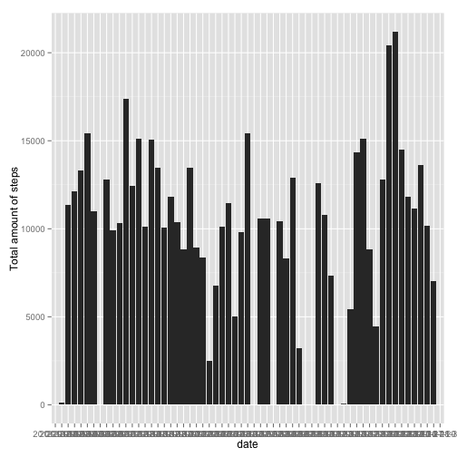
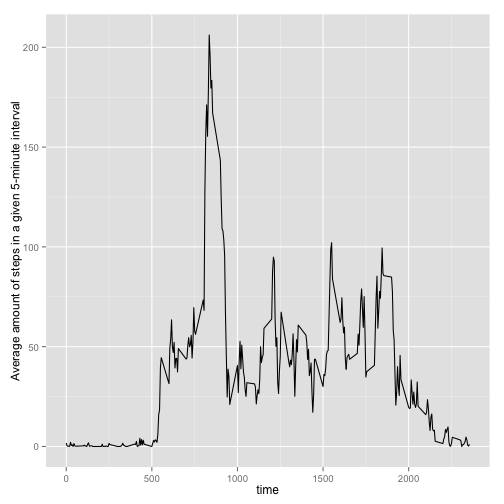
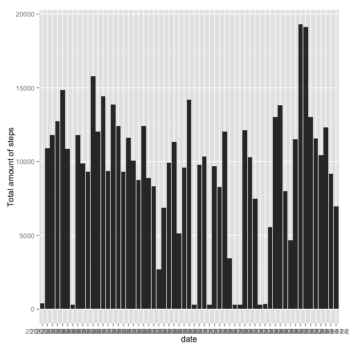
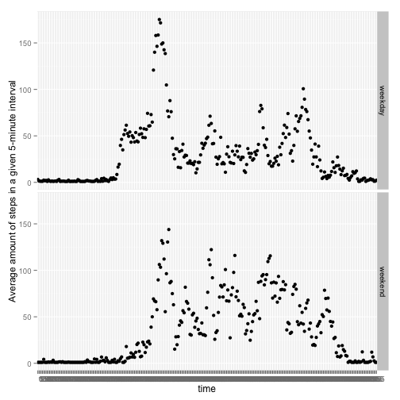

Assignent Number 1
========================================================


Here is a first assignment for the [Reproducible Research](https://class.coursera.org/repdata-004) coursera class. It is based on the dataset: [Activity monitoring data](https://d396qusza40orc.cloudfront.net/repdata%2Fdata%2Factivity.zip). A detailed description of an assignment and dataset can be found [here](https://github.com/kr0niker/RepData_PeerAssessment1/blob/master/README.md)

### Loading and preprocessing the data
#### The task:

1. Load the data (i.e. `read.csv()`)

2. Process/transform the data (if necessary) into a format suitable for your analysis

#### The result

We read the data file from the working directory and briefly summarize it

```r
data<-read.csv('activity.csv')
summary(data)
```

```
##      steps               date          interval   
##  Min.   :  0.0   2012-10-01:  288   Min.   :   0  
##  1st Qu.:  0.0   2012-10-02:  288   1st Qu.: 589  
##  Median :  0.0   2012-10-03:  288   Median :1178  
##  Mean   : 37.4   2012-10-04:  288   Mean   :1178  
##  3rd Qu.: 12.0   2012-10-05:  288   3rd Qu.:1766  
##  Max.   :806.0   2012-10-06:  288   Max.   :2355  
##  NA's   :2304    (Other)   :15840
```


### What is mean total number of steps taken per day?

#### The task:

For this part of the assignment, you can ignore the missing values in
the dataset.

1. Make a histogram of the total number of steps taken each day

2. Calculate and report the **mean** and **median** total number of steps taken per day

#### The result

We will make a hisogram using ggplo2 package. We aggregate the amount of steps for each day and draw a histogram

```r
library(ggplot2)
totals<-aggregate(data$steps, by=list(date=data$date), FUN=sum)
p1<-qplot(date, x, data=totals, geom="bar",stat="identity")
p1 + labs(y = "Total amount of steps")
```

```
## Warning: Removed 8 rows containing missing values (position_stack).
```

 

The mean and median are respectively

```r
mean(totals$x, na.rm=TRUE)
```

```
## [1] 10766
```

```r
median(totals$x, na.rm=TRUE)
```

```
## [1] 10765
```


### What is the average daily activity pattern?

#### The task:

1. Make a time series plot (i.e. `type = "l"`) of the 5-minute interval (x-axis) and the average number of steps taken, averaged across all days (y-axis)

2. Which 5-minute interval, on average across all the days in the dataset, contains the maximum number of steps?

#### The result

Now we need to aggregate our data in a different way, so that we can plot it, an analogue for 'type="l"' in ggplot2 would be 'geom="line' 


```r
avrsteps<-aggregate(data$steps, by=list(time=data$interval), FUN=mean,na.rm=TRUE)
p2<-qplot(time, x, data=avrsteps, geom="line")
p2 + labs(y = "Average amount of steps in a given 5-minute interval")
```

 

We can easily find an interval when there was a maximum amount of steps on average. In order to check the correctness of the code we also output not only the number of an interval in the data-set but also the time (so that a reader can compare it to the graph)


```r
which(avrsteps$x == max(avrsteps$x, na.rm=TRUE))
```

```
## [1] 104
```

```r
avrsteps$time[which(avrsteps$x == max(avrsteps$x, na.rm=TRUE))]
```

```
## [1] 835
```


### Imputing missing values

#### The task:

1. Calculate and report the total number of missing values in the dataset (i.e. the total number of rows with `NA`s)

2. Devise a strategy for filling in all of the missing values in the dataset. The strategy does not need to be sophisticated. For example, you could use the mean/median for that day, or the mean for that 5-minute interval, etc.

3. Create a new dataset that is equal to the original dataset but with the missing data filled in.

4. Make a histogram of the total number of steps taken each day and Calculate and report the **mean** and **median** total number of steps taken per day. Do these values differ from the estimates from the first part of the assignment? What is the impact of imputing missing data on the estimates of the total daily number of steps?

#### The result

The total number of missing values could be reported by a very straightforward procedure

```r
sum(is.na(data))
```

```
## [1] 2304
```

We will deal with NAs with as following algorithm. First we will cut a series of NA that start the dataframe (it is a series of approx. 250 missing values, it is almost one day of the data that is missing), then we just replace the other NAs in the dataset with the value of the previous cell. All these actions can be simply done using zoo package.


```r
library(zoo)
dt<-as.zoo(data) ##we converge the initial dataframe into the zoo
trimmeddt<-na.trim(dt) ##we trim the zoo
nona<-as.data.frame(na.locf(trimmeddt)) ##replace the NAs with the previous values and convert the object back to the dataframe
```
'nona' is the new dataset that is equal to the original dataset but with the missing data filled in.

Let us plot two historgams. With NA removed and a starting one. So the we can better compare them.

```r
totalnona<-aggregate(as.numeric(nona$steps), by=list(date=nona$date), FUN=sum)
p3<-qplot(date, x, data=totalnona, geom="bar",stat="identity")
p3 + labs(y = "Total amount of steps") + labs(Title = "Total amount of steps NA removed")
```

 

```r
p1 + labs(y = "Total amount of steps") + labs(Title = "Total amount of steps with NA")
```

```
## Warning: Removed 8 rows containing missing values (position_stack).
```

 

The pictures differ a bit but not drasitically. The difference can be better seen for the median and mean respectively

```r
mean(totalnona$x)
```

```
## [1] 9213
```

```r
median(totalnona$x)
```

```
## [1] 9934
```

Due to the fact that we have replaced the NA with the nighbour values the mean and median reduced and started to differ from one another. This is due tot he fact that the missing values occured mostly in the periods of low activities.


### Are there differences in activity patterns between weekdays and weekends?

#### The task:

1. Create a new factor variable in the dataset with two levels -- "weekday" and "weekend" indicating whether a given date is a weekday or weekend day.

2. Make a panel plot containing a time series plot (i.e. `type = "l"`) of the 5-minute interval (x-axis) and the average number of steps taken, averaged across all weekday days or weekend days (y-axis). The plot should look something like the following, which was creating using **simulated data**:


```r
daytype <- weekdays(as.Date(nona$date))
filterSat<-daytype[]=="Saturday" 
filterSun<-daytype[]=="Sunday"
filter<-filterSat | filterSun
nona$weekday <- ifelse(filter,"weekend","weekday") ##factor added
avrstepsdays<-aggregate(as.numeric(nona$steps), by=list(time=nona$interval, weekday=nona$weekday), FUN=mean)
p4<- qplot(time, x, data=avrstepsdays, facets=weekday~.)
p4 + labs(y = "Average amount of steps in a given 5-minute interval")
```

 

